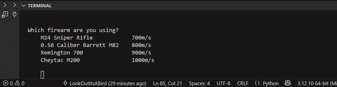

# SniperBallistics
### Description
Calculate what angle your sniper rifle should be aimed to eliminate the target.

  

### Physics Calculations

  

### Learning Overview
 - math library (atan, sqrt)
